###Author:kevin.fu
###Email: kevinfu1985@gmail.com
###Date:  2013.09.02

##23 Design patterns implemented by cpp with codeblocks

###The dierectory "Factory" consist of 23 projects which are the implementation of the ###23 kinds design patterns!", 

###The following two pictures are the UML relationship of these these project.

FactoryMethod pattern
-
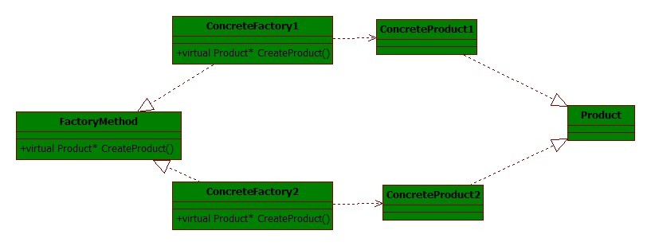

AbstractFactory pattern
-

Builder pattern
-
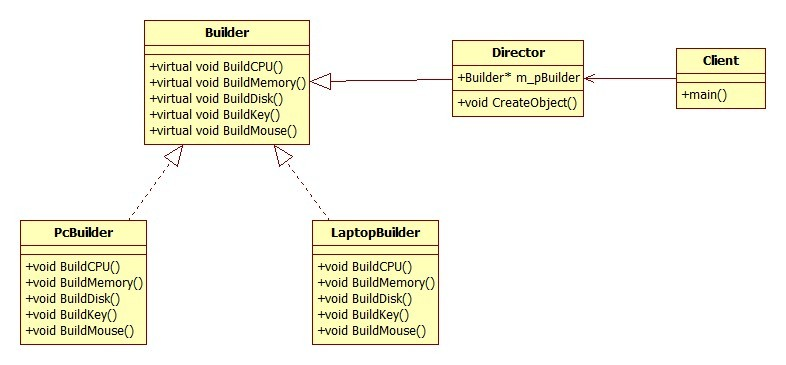

Prototype pattern
-
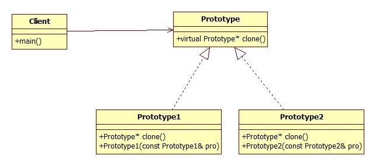

Bridge pattern
-
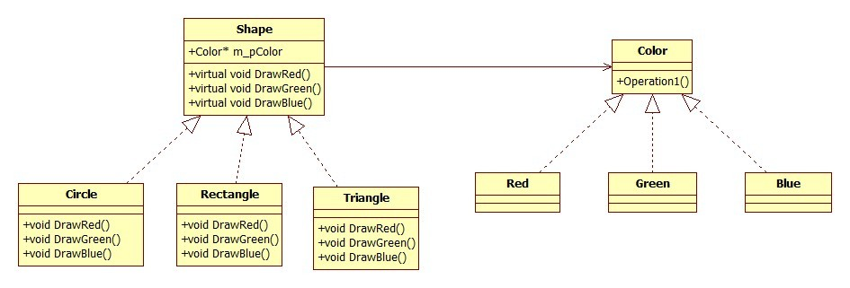

classAdapter pattern
-
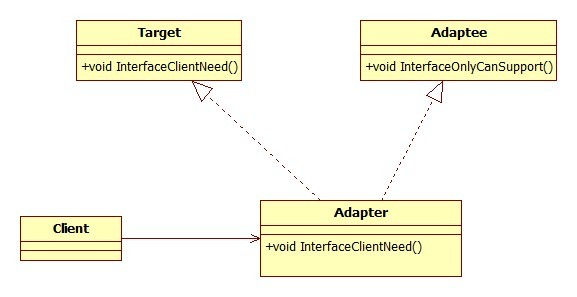

InstanceAdapter pattern
-

Decorator pattern
-
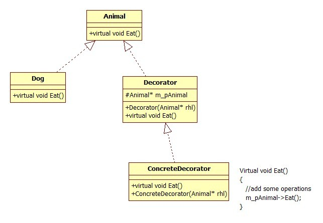

Compositor pattern
-
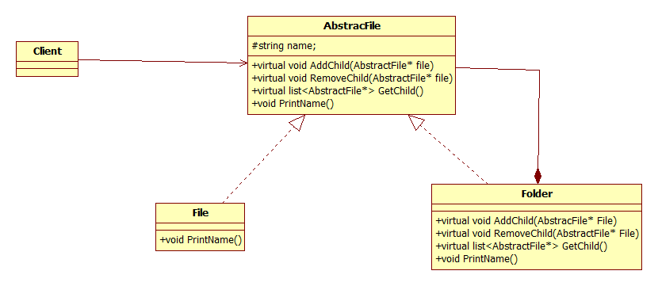

Flyweight pattern
-
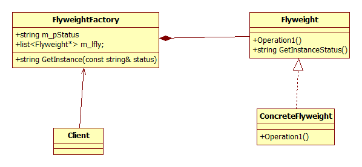

Facade pattern
-
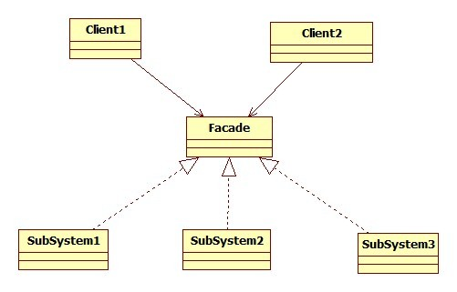

Proxy pattern
-
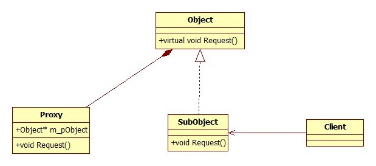

Template pattern
-
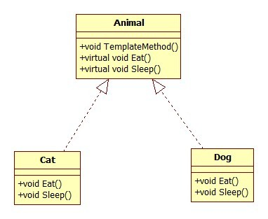

Strategy pattern
-
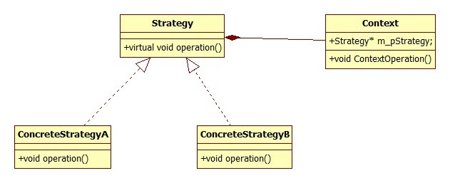

State pattern
-
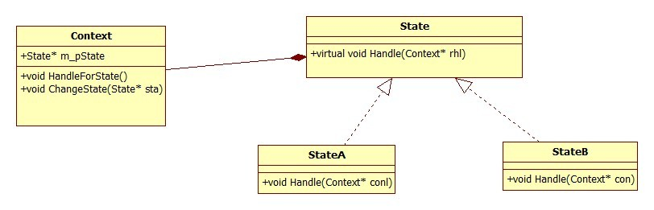

Observer pattern
-
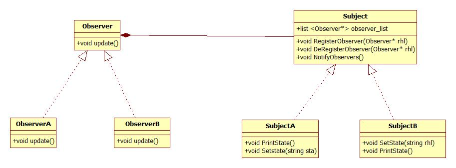

Memento pattern
-
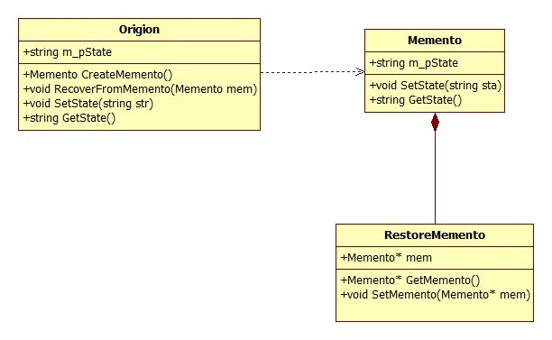

Mediator pattern
-
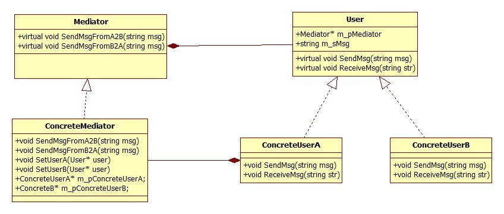

Command pattern
-
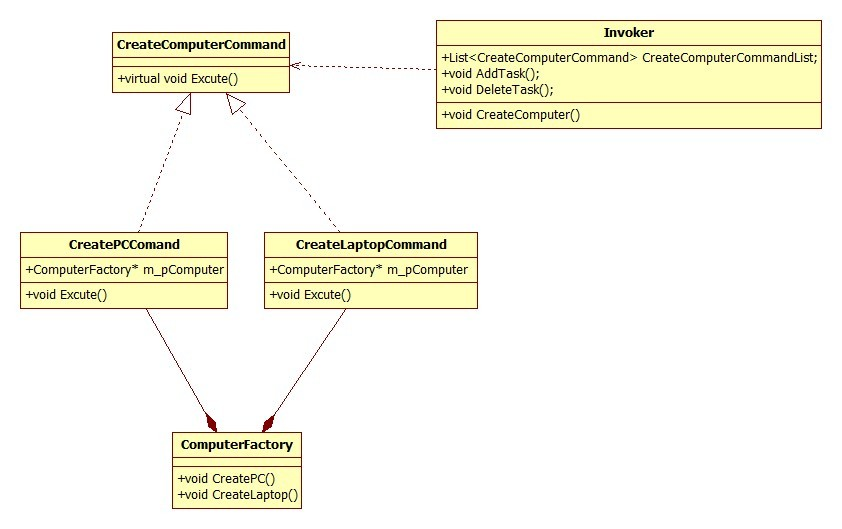

Visitor pattern
-
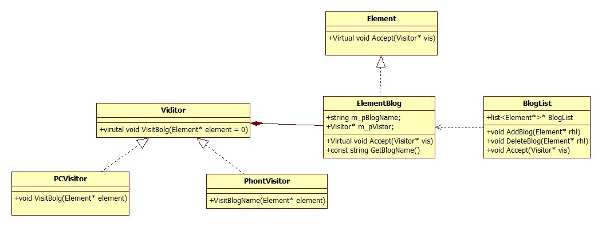